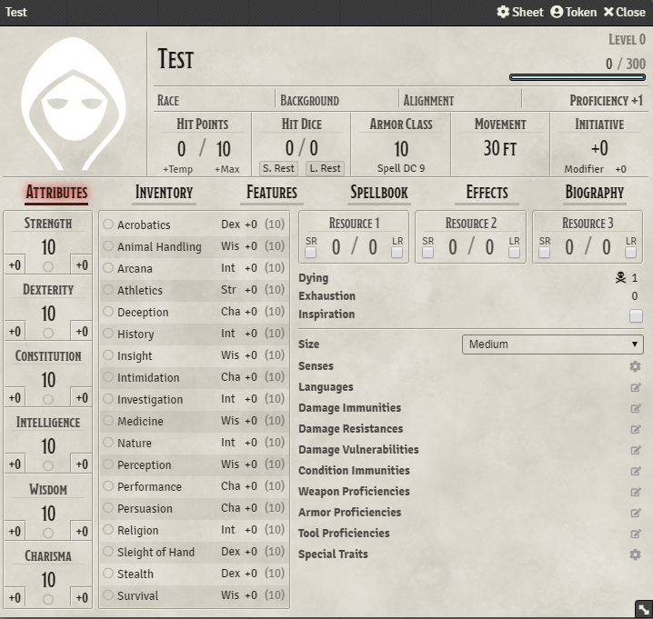
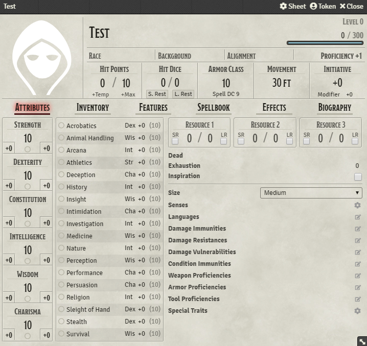

# DnD 5e Dying condition

This is a module for Foundry Virtual Tabletop adds a condition similar to Pathfinder's Dying condition to DnD 5e.

Currently, this only supports the default sheet.

## Features
* Replaces the death saves on the character sheet with a representation of the dying condition.
  Clicking it will still roll the death save but with the new DC.
* Once a character reaches 0 HP automatically set the dying level according to the current exhaustion.
* If a character has more than 1 HP or has already reached maximum dying it won't allow to roll a death save.

## Installation
Simply use the install module screen within the FoundryVTT setup.

The rules for this *new* condition are as follows:

### Dying
When you are reduced to 0 hit points you fall unconscious and get the Dying 1 Condition, if you had any exhaustion level the moment you received the dying condition add the number of levels to the Dying Condition value.

### Dying Condition
You are bleeding out or otherwise at death’s door. While you have this condition, you are unconscious. Dying always includes a value. If this value ever reaches dying 6, you die and, if it ever reaches 0 you lose the dying condition.  
Anytime you lose the dying condition, you gain one level of exhaustion.  
If you start dying while exhausted, increase the dying value by your exhaustion level. This means that if you die with exhaustion 5 you instantly die.  
Whenever you start your turn with the dying condition you must make a Death Saving Throw to determine whether you creep closer to death or hang onto life. Unlike other saving throws, this one isn't tied to any ability score. You are in the hands of fate now, aided only by spells and features that improve your chances of succeeding on a saving throw.

### Death Saving Throw
When you’re dying, at the start of each of your turns, you must attempt a flat check(no bonus added) with a DC equal to 10 + your current dying value to see if you get better or worse. This is called a Death Saving Throw. The effects of this check are as follows.  
Nat 20 Your dying value is reduced by 2.  
Success Your dying value is reduced by 1.  
Failure Your dying value increases by 1.  
Nat 1 Your dying value increases by 2.  
If dying ever reaches 0 you lose the dying condition and are considered stable. If you have 0 hit points when you lose the dying condition you remain Unconscious.  

## Images
When character is dying

When character has 1 or more HP

When character truly died

## Bug Reporting
There might be a few bugs left. Feel free to open new issues if you find any issues.

## Special Thanks
[Ilandril](https://github.com/illandril) for his modules that I used to base mine on and specially the github actions files which I just copied over and modified a tiny bit.
